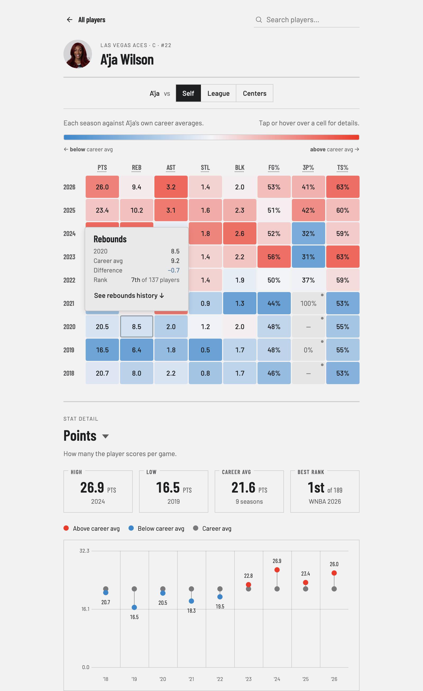
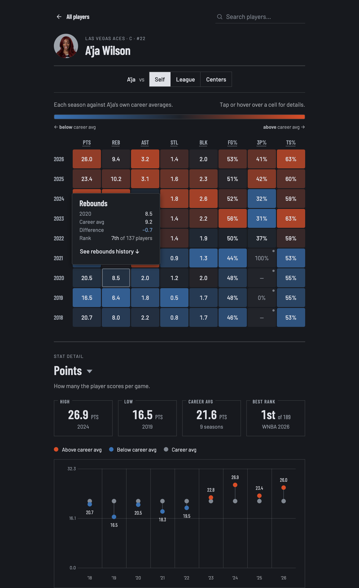

# WNBA Arc

**Is this the best season of a player's career, or just another year at the office?**
WNBA Arc reframes each stat as a distance from what's normal for that player, so a
career year stands out at a glance and a quiet one does too.

**[Live demo →](https://wnba-arc.netlify.app)**

| Season summary — light | Season summary — dark |
| :--: | :--: |
|  |  |

---

## The idea

A single stat line rarely tells you much. Is 18 points a big year for a player, or a
typical one? WNBA Arc answers that by measuring every stat against a baseline — the
player's own history or the league average — and showing how far above or below that
baseline each season lands. You still see the real numbers; the visualization just tells
you how unusual they are.

## What it does

- **Career Trend** — a heatmap of every season against the player's career average
  (warmer above, cooler below), so a whole career reads in one glance.
- **Season Breakdown** — segmented deviation bars for one selected season against a chosen
  baseline, in each stat's own units.
- **Single-stat drill-down** — a year-by-year dumbbell chart plus a full history table for
  any stat.
- **Three baselines** — compare a season against the player's own history, other players at the
  **same position** (guards / forwards / centers), *or* the league — over a this-season /
  previous-year / previous-5-years / career window. Options that wouldn't change the result are
  hidden, so every control that's shown actually matters.
- **Honest about the data** — missed seasons show as gaps in the timeline, small-sample
  seasons are flagged and kept out of baselines, and stats that can't be sourced reliably are
  left out rather than estimated.
- **Light & dark themes** that follow the OS by default, with a manual toggle.

## Accessibility

Built to **WCAG 2.1 AA**: keyboard-operable throughout, semantic landmarks and headings,
non-color cues alongside every color encoding, and AA-contrast text in both themes. Audited
with axe across Chromium, Firefox, and WebKit — zero violations.

## Tech

- **React 19 + TypeScript + Vite**
- Plain CSS design-system tokens (single source for spacing, color ramps, and both themes)
- A layered structure: typed API client → pure logic (baselines, windows, deviation math,
  no React) → components
- Data comes from a **companion service** (a separate Node/TypeScript + Express + Postgres
  API) over a small JSON contract. This repo is the frontend of that two-part system.

## Running locally

Requires Node 20+ and a running instance of the data API.

```bash
npm install
cp .env.example .env      # then set VITE_API_BASE to your data API's URL
npm run dev               # http://localhost:5173
```

Other scripts:

```bash
npm run build     # type-check (tsc -b) + production build
npm run preview   # serve the production build locally
npm run lint      # type-check only
npm run test      # run the unit tests (vitest) once
npm run test:watch # re-run tests on change
```

Tests cover the pure baseline logic in `src/lib/deviation.ts` (subject selection,
small-sample gating, baseline-window rules) — see `src/lib/deviation.test.ts`.

## Data source

Player stats come from ESPN's public stats data, refreshed nightly, with efficiency stats
(true shooting %, usage rate, and the rest) computed from box-score totals so they stay
consistent with the raw numbers. A few stats are intentionally omitted — rebound percentages
need opponent data that isn't published, and all-in-one metrics like PER can't be derived
from a box score — rather than shipping unreliable numbers.
