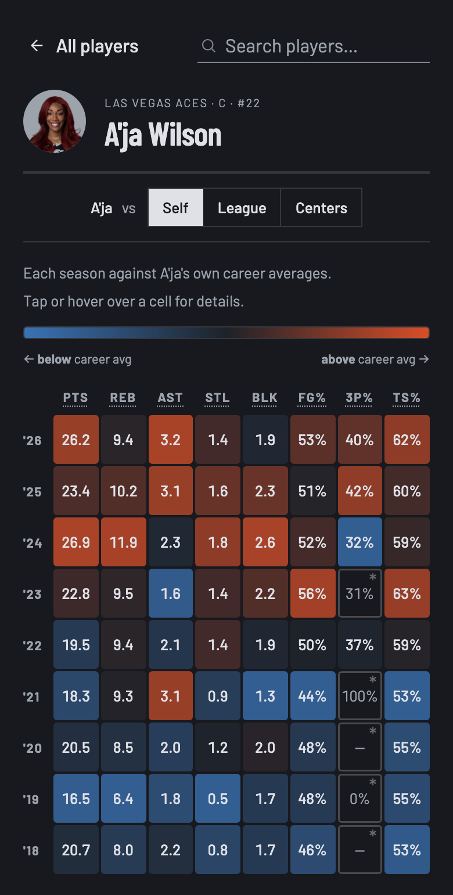
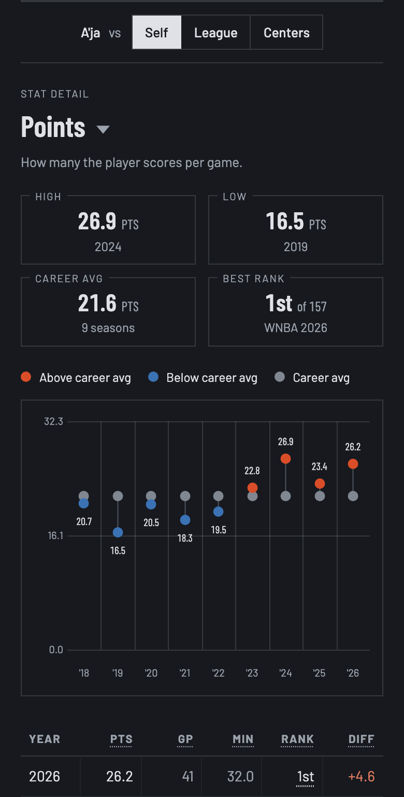

# WNBA Arc

A full-stack data app that compares each season of a WNBA player's career with their own career
average, the league that year, or players at their position. Every season is shown as a heatmap of
eight stats.

The system is two repositories: this one, the **React + TypeScript frontend**, and
**[wnba-data](https://github.com/camrynobscura/wnba-data)**, a **Node + Postgres data service** that
ingests ESPN's stats every day, computes the averages, spreads and ranks, and serves them through a
small read-only API. This README covers both.

**[Live demo →](https://wnba-arc.netlify.app)**

| Heatmap | Stat detail |
| :--: | :--: |
|  |  |

## Stack

| Layer | Built with | Runs on |
| --- | --- | --- |
| Frontend | React 19, TypeScript, Vite, react-router 7, plain CSS design tokens | Netlify (static build) |
| API | Node, TypeScript, Express 5, raw `pg` (no ORM) | Render |
| Database | Postgres, 9 plain-SQL migrations | Supabase |
| Ingest | TypeScript scripts over ESPN's public JSON | GitHub Actions, daily |
| Tests | Vitest: 143 frontend, 72 backend | |

## Architecture

```
ESPN JSON  ->  ingest scripts  ->  Postgres  ->  Express API  ->  React app
               (GitHub Actions)    (Supabase)    (Render)         (Netlify)
```

The API's JSON is the only contract between the two repos. The frontend keeps its own mirror types
instead of a shared package, and the database stays private behind the API.

### Data service ([wnba-data](https://github.com/camrynobscura/wnba-data))

**Ingest**
- Discovers every player who has appeared in a WNBA regular season since 1997 (1,218 today) and
  stores each season's box-score totals, minutes and team history.
- ESPN's stats API is undocumented. The client identifies itself with its own User-Agent, retries 429s, 5xx errors
  and network failures with backoff, treats a 404 as "no data" rather than an error, and keeps at
  most 5 requests in flight.
- Every write is an idempotent upsert, so any run can be repeated safely. Failed player ids are
  written to a file so a retry doesn't need a fresh discovery pass.
- A traded player's season is stored as one total row plus a row per team stint.
- Team names are era-accurate: franchise identity is kept separate from naming eras and joined by
  year range, so an old season shows the name the team had then (the San Antonio Stars, not the Las
  Vegas Aces).

**Schema**
- One row per player-season is the core grain. Counting stats are integer season totals; rates are
  `numeric`, never float.
- Efficiency stats (true shooting %, effective FG%, turnover %, 3-point attempt rate, free-throw
  rate) are Postgres generated columns, so they always match the totals.
- `team_season_games` holds how many games each team played each season, and the
  `player_season_team_games` view turns it into "games the player's team played". Every average,
  rank and minimum reads its game counts from this view.
- `league_seasons` and `position_seasons` hold per-year averages, standard deviations for the
  counting stats, and decile ladders.
- `scrape_runs` keeps an audit row per run: start, finish, status, players updated, and the date of
  the last completed game.

**Averages and ranks**
- A season qualifies at 20 games per 44 of its team's games, compared in integers
  (`games_played × 44 >= 20 × team_games`) to avoid rounding errors at the cutoff. Only qualified
  seasons are used for the averages, spreads and ranks, so all three cover the same players.
- Ranks are computed in SQL with `RANK() OVER (PARTITION BY season_year ...)`, once league-wide and
  once per position. Shooting percentages rank in their own pool: seasons that also cleared an
  attempts-or-makes floor, scaled to the team's games.
- A position average needs at least 8 qualified players. Position ranks exist only for years where
  every qualified player has a position on record (2012 on; ESPN has none for most earlier players).

**Daily refresh**
- A GitHub Actions cron (4:23 AM Eastern, with an explicit time zone) re-ingests only the current
  season, since past seasons never change. It reads every team's schedule for games played so far
  and the last completed game, then rebuilds the season's averages and spreads.
- The job uses the current year, so it moves to the next season without code changes.
- It sends a Telegram alert when a featured player's identity changes or ESPN renames a
  team, since both need a matching change in the frontend.

**API**

| Endpoint | Returns |
| --- | --- |
| `GET /players?scope=all` | every player on record: id, name, team, position, career span (`scope=current`, the default, is the last 3 seasons) |
| `GET /players/:id` | one player's full regular-season history, with each season's league and position rank and their team's games |
| `GET /league` | per-year league averages, standard deviations, decile ladders and schedule lengths |
| `GET /positions` | per-year, per-position averages where the bucket exists |
| `GET /meta` | freshness: `statsThrough` (the last completed game) and `lastScrapedAt` |

Protections, since the API is public and runs on free tiers: `helmet` headers, CORS
limited to the frontend's origin and GET, 100 requests per minute per IP (trusting exactly one proxy
hop, so the limit keys on the real client and not Render's proxy), a connection pool capped at 5
with a 10-second statement timeout, and idle-connection errors logged instead of crashing the
process. An uptime monitor pings the API so Render's free tier doesn't put it to sleep.

### Frontend (this repo)

Dependencies point one way, **components → lib → data**:

- **`src/data/`** is the only layer that touches the network. [`api.ts`](src/data/api.ts) is the
  typed client and the contract types. It caches each player for the visit and shares in-flight
  requests, so returning to a player doesn't fetch it again.
- **`src/lib/`** is pure logic with no React and no fetch. [`deviation.ts`](src/lib/deviation.ts)
  turns season rows plus league and position data into the heatmap grid, the comparison buttons and
  the stat detail (plates, chart, table). The rest: `search.ts` (ranked player search),
  `gridNav.ts` (the heatmap's arrow keys), `routes.ts` (URL slugs), `playerMeta.ts`,
  `loadFailure.ts`, `theme.ts`.
- **`src/routes/` + `App.tsx`**: the shell loads the player list, league and position data, and
  freshness once and shares them through context. `PlayerLayout` fetches one player and frames the
  loading, error and not-found states.
- **`src/components/`**: the heatmap and its popover, the comparison bar, the stat detail, search,
  tooltips, footer, and the landing and About pages.
- **`src/styles/theme.css`** holds all the design tokens: the gray ramp, the heatmap's red/blue
  scale, spacing, the type scale and both themes. The UI is grayscale; color is used only for the
  heatmap and the team tints on headshots.

The URL holds the whole view state (`/player/aja-wilson/blk?vs=league`), so back and forward,
refresh and shared links all open the same view. Netlify serves the static build with an SPA fallback.

## How the comparison works

All of this lives in [`src/lib/deviation.ts`](src/lib/deviation.ts). The heatmap and the stat detail
use the same functions, so they always match.

**References.** *Self* compares each season with the player's career average. *League* and
*Position* compare it with players from that same season. There's no multi-year window, so the
average, the color scale and the rank all use the same group of players.

**Color strength.**
- Counting stats against the league or a position: the gap divided by that season's standard
  deviation, full color at 3 (`FULL_STEPS`). A plain percentage difference doesn't work: stars would reach
  full color on every stat, and small numbers get exaggerated (0.1 to 0.2 blocks is +100%).
- Shooting percentages: the relative gap, full at ±50% (`BAR_FULL_SCALE`).
- Self: scaled to the player's own biggest swing, with a floor of half the league's spread
  (`HEATMAP_STEP_FLOOR`), so small changes in a steady career don't show as strong colors.

**Minimums.** Games scale with the player's own team's games; the shooting floors to color are fixed
counts.

| | To be colored | To be ranked (per 44 team games) |
| --- | --- | --- |
| Games | a quarter of the team's games (11 of 44) | 20 of 44 |
| 3P% | 40 attempts | 60 attempts or 20 makes |
| FG% | 100 attempts | 200 attempts or 85 makes |
| TS% | 100 TS attempts (FGA + 0.44 × FTA) | 125 TS attempts |

- A season between the two games bars is a *partial season*: colored and counted in the career
  average, marked with an asterisk, not ranked.
- Career shooting percentages pool makes over attempts across seasons (`SUM(made) / SUM(att)`),
  never an average of season percentages.
- The best-rank plate picks the season by its share of the pool, not the raw place, because the
  number of players has grown over time (27th of 106 ranks above 18th of 65).

## Accessibility

Built to **WCAG 2.2 AA**:

- The heatmap is an ARIA grid with a roving tabindex: one Tab stop, arrow keys between cells, Enter
  for the stat's history. Each cell's name carries the value, the difference, the reference and the
  rank.
- Tooltips and the popover open on hover, focus and tap, stay hoverable, and close with Escape.
- On a page change, focus moves to the new page's heading. The sticky comparison bar is measured with
  a `ResizeObserver` so focus never lands under it, and it stops sticking when it would cover more
  than a fifth of the screen.
- Layouts that must adapt to enlarged text use container queries in `em`, so they respond to the
  reader's text size, not just the screen width. Checked from 320px to desktop at 100 to 200% text.
- In Windows High Contrast mode, the heatmap keeps its colors and everything else uses the user's
  palette.
- Every page state is scanned with axe in Chromium, Firefox and WebKit, in both themes: 0
  violations. A manual screen-reader pass hasn't been done yet.

## Engineering notes

- **Tooltips aren't `position: fixed`.** iOS 26 Safari tints its toolbars from any fixed or
  top-layer element, so tooltips are absolutely positioned inside the page (a portal into `<main>`),
  placed from the trigger element's bounding box.
- **Load errors.** A failed load shows "Try refreshing the page in a minute", or an
  offline message while the browser reports no connection (`navigator.onLine` through
  `useSyncExternalStore`). The raw error goes to the console.
- **Shared constants.** The games threshold, the shot floors and the team game counts are defined
  once in each repo, with matching names and comments that point to the other repo.

## Running locally

The frontend needs Node 20.19+ or 22.12+ and the data API running on port 3001 (setup is in the
[wnba-data](https://github.com/camrynobscura/wnba-data) README).

```bash
npm install
npm run dev               # http://localhost:5173 (or the next free port)
```

No `.env` is needed in dev: Vite proxies `/api` to the data API, so the browser never makes a
cross-origin request, and a phone on the same wifi works too (`npm run dev -- --host`).
`VITE_API_BASE` is only for production builds (see `.env.example`).

```bash
npm run build       # type-check + production build
npm run preview     # serve the production build
npm run lint        # type-check only
npm run test        # unit tests, once
npm run test:watch  # re-run on change
```

**Tests.** Frontend (143, 13 files): the grid, references, games and shots minimums, pooled averages, number
formatting, the comparison buttons, the chart axis and best-rank rule, arrow-key movement, URL slugs,
search ranking, the header line, the footer's freshness line, tooltip placement, the player cache,
headshot addresses, the API address, the browser bar color and the security headers.
Backend (72, 8 files): ESPN parsing, team game counts, schedule reading, role rates, the change
alerts, the database connection's encryption settings and player id checks.

## Data source

Player stats come from ESPN's public stats endpoints. True shooting % is computed from box-score
totals rather than taken from a precomputed field. Rebound percentages and all-in-one ratings like
PER aren't included: ESPN doesn't publish the opponent data or ratings they need.

WNBA Arc is an independent, unofficial project, not affiliated with the WNBA or ESPN.
